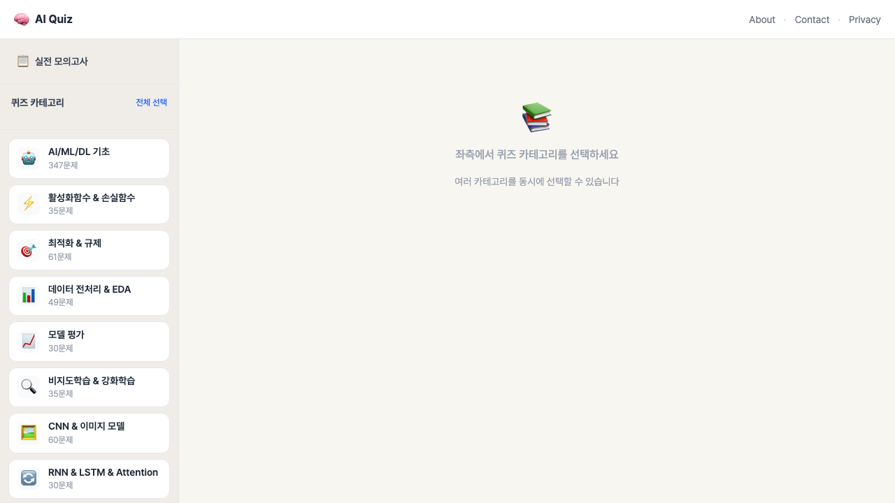
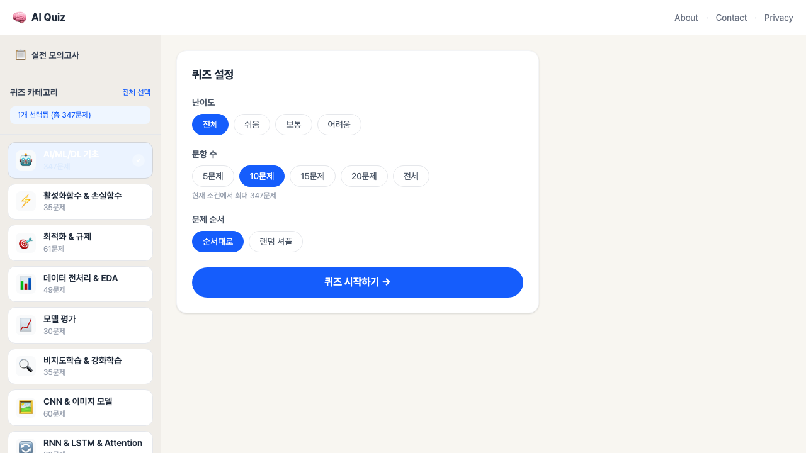
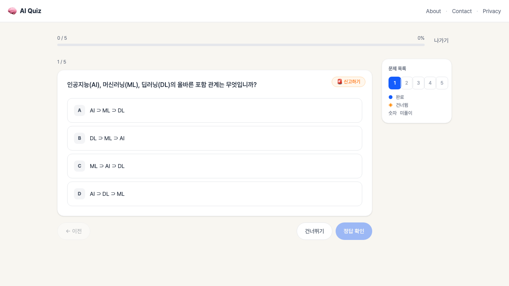
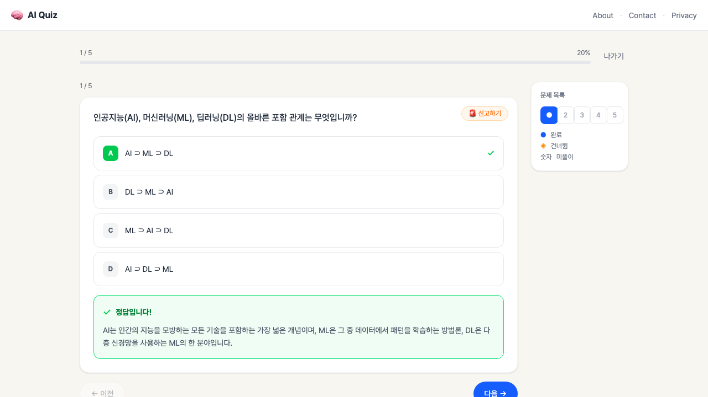
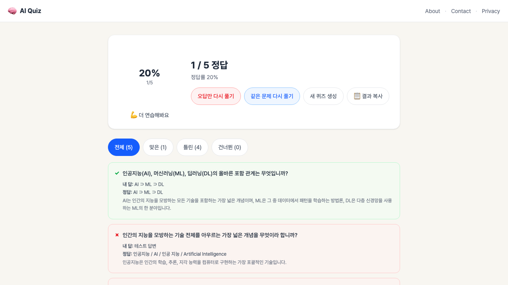
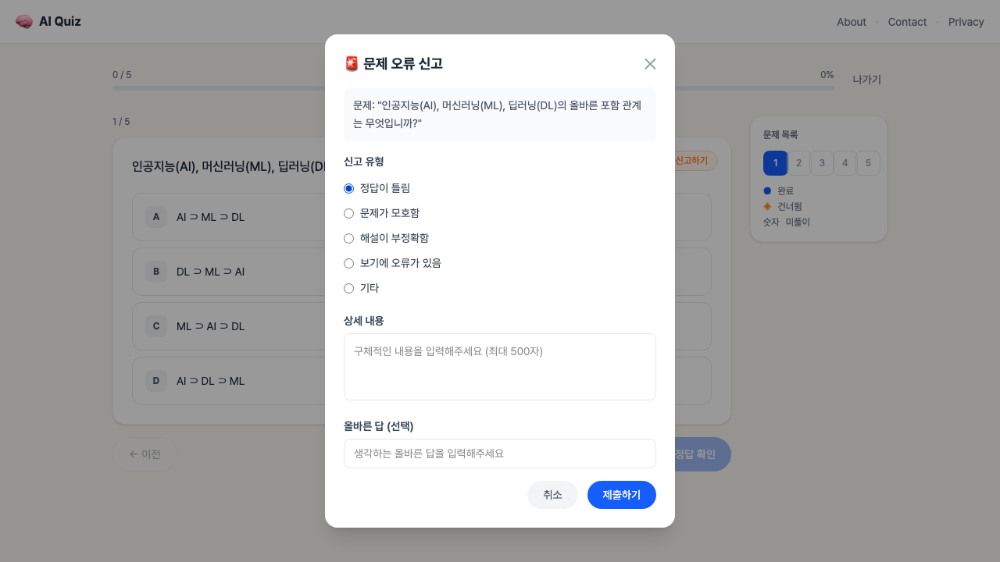
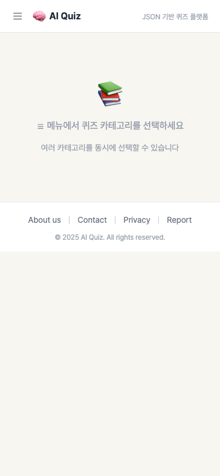
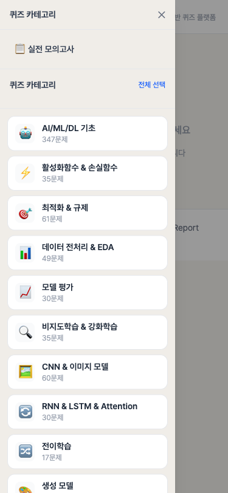
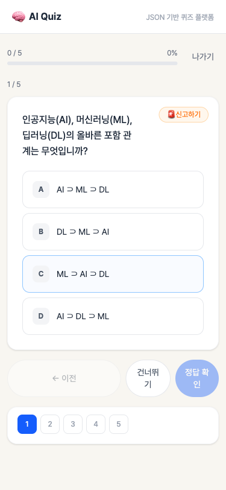

# AI Quiz

      

        <h3>AI Quiz</h3>
        <b>기간</b>2026.03 (4시간 MVP + 약 2주 개선)
        ★본인 개발 1인 · 문제 제작 2인
        <a class="ab-visit" href="https://ai-quiz-xi-livid.vercel.app/" rel="noopener" target="_blank">사이트 이동하기 ↗</a>
        <a class="ab-visit gh" href="https://github.com/jhs7942/ai-quiz" rel="noopener" style="margin-left:8px" target="_blank"><svg width="15" height="15" viewBox="0 0 16 16" fill="currentColor" aria-hidden="true" style="flex-shrink:0"><path d="M8 0C3.58 0 0 3.58 0 8c0 3.54 2.29 6.53 5.47 7.59.4.07.55-.17.55-.38 0-.19-.01-.82-.01-1.49-2.01.37-2.53-.49-2.69-.94-.09-.23-.48-.94-.82-1.13-.28-.15-.68-.52-.01-.53.63-.01 1.08.58 1.23.82.72 1.21 1.87.87 2.33.66.07-.52.28-.87.51-1.07-1.78-.2-3.64-.89-3.64-3.95 0-.87.31-1.59.82-2.15-.08-.2-.36-1.02.08-2.12 0 0 .67-.21 2.2.82.64-.18 1.32-.27 2-.27.68 0 1.36.09 2 .27 1.53-1.04 2.2-.82 2.2-.82.44 1.1.16 1.92.08 2.12.51.56.82 1.27.82 2.15 0 3.07-1.87 3.75-3.65 3.95.29.25.54.73.54 1.48 0 1.07-.01 1.93-.01 2.2 0 .21.15.46.55.38A8.013 8.013 0 0016 8c0-4.42-3.58-8-8-8z"></path></svg>GitHub</a>
      

      

        React 19
        TypeScript
        Zustand
        Tailwind CSS
        Vite
        Supabase / PostgreSQL
        Vercel
        Claude Code
      

      
싸피에서 AI 시험 이틀 전, 교육생들은 시험 대비를 위해 각자 생성형 LLM으로 기출 문제를 만들어 풀고 있었습니다. 
기출 문제를 만들기 위해 각자 시험 범위를 지정해야 했고, <b>실제 배웠던 내용이 아닌 부분도 생성될 수 있었으며</b>, 제작에만 <b>약 10분</b>이 소요되었습니다. 
환경상 PC에서만 가능해 <b>이동 중에는 활용할 수 없었습니다.</b>

      
이에 비효율성을 느껴, 미리 검수한 문제로 문제은행 사이트를 만들어 공유하면 교육생들에게 도움이 될 것이라고 생각했습니다. 
시험까지 이틀이 남았기에 실사용 기간을 고려하여, 기획과 배포를 포함한 개발 기간을 <b>4시간</b>으로 잡고 Claude Code로 개발했습니다.

      
이 프로젝트는 서울에서 시작해 부산 · 광주 등 전국 캠퍼스에서도 활용되었으며, <b>2주간 사용자 피드백과 지표를 보며 개선했습니다.</b>

        

          

            ▼
          

          

            

              문제
              <ul>
                <li><b>4시간</b> 안에 배포하려면 평소 쓰던 절차를 전부 밟을 수 없어, <b>무엇을 버릴지 먼저 정해야</b> 했습니다.</li>
                <li>Claude Code <b>Pro 요금제</b>라 토큰 한도도 있었습니다. 시간뿐 아니라 <b>어디에 토큰을 쓸지</b>도 함께 정해야 했습니다.</li>
              </ul>
            

            

              해결
              

                
문제 생성 및 검수 (팀원 2명 운영)

                <table class="ab-rtable" style="margin:0">
                  <tbody>
                    <tr>
                      <th>전사</th>
                      <td>강의를 재생하며 <b>실시간 전사 앱으로 텍스트를 확보</b>했습니다.</td>
                    </tr>
                    <tr>
                      <th>초안</th>
                      <td>전사 텍스트를 <b>NotebookLM 소스로 넣어</b> 퀴즈 초안을 자동 생성했습니다.</td>
                    </tr>
                    <tr>
                      <th>검수</th>
                      <td>정답 · 해설과 <b>시험 범위를 교재와 대조</b>해 확정하고, 앱 JSON 스키마로 변환했습니다.</td>
                    </tr>
                  </tbody>
                </table>
                
절차 생략

                <ul>
                  <li>디자인 시안, 코드 리뷰 에이전트, 자동 테스트 세 가지를 <b>의도적으로 생략</b>했습니다.</li>
                </ul>
                <table class="ab-rtable" style="margin:8px 0 0">
                  <tbody>
                    <tr>
                      <th>디자인 시안</th>
                      <td>토큰 소모가 가장 큰 구간이라 생략했습니다. <b>문제를 읽고 푸는 데 지장이 없으면 충분하다</b>고 기준을 정하고, 시안 없이 바로 구현했습니다.</td>
                    </tr>
                    <tr>
                      <th>코드 리뷰</th>
                      <td>가독성과 확장성보단 <b>당장의 기능 구현이 더욱 중요했기에</b> 생략했습니다. 이후 리뷰 에이전트를 돌리자 <b>배치 저장에서 동시성 버그가 나왔습니다.</b></td>
                    </tr>
                    <tr>
                      <th>자동 테스트</th>
                      <td>토큰 한도가 빠듯해 <b>테스트는 로컬 환경에서 직접</b> 진행했습니다.</td>
                    </tr>
                  </tbody>
                </table>
              

            

            

              결과
              

                <table class="ab-rtable metric">
                  <tbody>
                    <tr>
                      <th>개발 기간</th>
                      <td class="v">4시간</td>
                      <td class="n">기획부터 배포까지</td>
                    </tr>
                    <tr>
                      <th>문제은행</th>
                      <td class="v">12개의 카테고리에 총 1,160문제 발행</td>
                      <td class="n">AI 초안 + 팀원 2명이 정답 · 해설 · 범위 검수</td>
                    </tr>
                    <tr>
                      <th>문제 풀이</th>
                      <td class="v">92,329회</td>
                      <td class="n"></td>
                    </tr>
                    <tr>
                      <th>활성 학습자</th>
                      <td class="v">826명</td>
                      <td class="n">싸피 교육생 약 1,000명 중</td>
                    </tr>
                    <tr>
                      <th>재시도 정답률</th>
                      <td class="v">67% → 75%</td>
                      <td class="n">같은 사용자가 같은 문항을 다시 풀 때</td>
                    </tr>
                    <tr>
                      <th>피드백 반영</th>
                      <td class="v">134건 중 120건 반영 (약 90%)</td>
                      <td class="n">서비스 내 신고 · 개선 요청 기준</td>
                    </tr>
                  </tbody>
                </table>
              

            

          

        

      

    

---

## 화면

| 메인 — 카테고리 진입 | 카테고리·난이도·문제 수 설정 |
|:---:|:---:|
|  |  |
| **퀴즈 풀이** | **정답·해설 즉시 피드백** |
|  |  |
| **결과 — 점수·정답률** | **문제 신고 모달** |
|  |  |

### 모바일

| 메인 | 사이드 드로어 | 퀴즈 풀이 |
|:---:|:---:|:---:|
|  |  |  |
